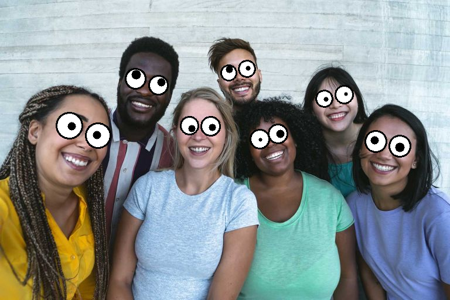
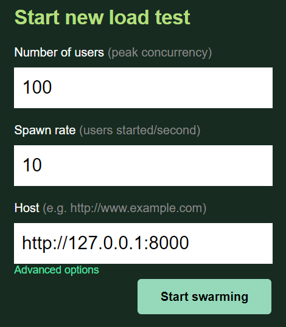

# Googly Eyes Service


Here you can find all the code that implements a service that makes the eyes in your pictures **GOOGLY**.
## Code structure

```
GooglyEyesService
├── docs
├── models
├── src
├── tests
├── Dockerfile
├── docker-compose.yaml
├── poetry.lock
├── pyproject.toml
└── .env
````

- ````docs````: Directory with files required in the readme and further documentation.
- ````models````: Directory with the model files used in the service.
- ````src````: Directory with all the code needed for the service. It contains two folders inside: 
  - ````api```` with the main Rest API code including it's endpoints;
  - ````gui_app```` with code to run a simple GUI app to run the "googlifier" in realtime with the webcam input.
- ````tests````: Directory with all the code to run tests with two folders inside:
  - ````performance_tests```` with code to run load testing on the service using the library 'locust';
  - ````unit_tests```` with the code to perform the unit tests.
- ````Dockerfile```` and ````docker-compose.yaml````: Files to run docker and docker compose, respectively.
- ````poetry.lock```` and ````pyproject.toml````: Files to create the virtual environment needed to run the code using 'poetry'.
- ````.env````: File with the environment variables that will be needed when running the service.


## (Recommended) Run with Docker 

 - (If you haven't yet) Install [Docker](https://docs.docker.com/engine/install/) and [Docker Compose](https://docs.docker.com/compose/install/).
 - Run:
```bash
docker compose up --build
```

## (Option) Run locally

- (If you haven't yet) Install the dependency manager [Poetry](https://python-poetry.org/docs/).
- Setup environment:

1. Add the ```GooglyEyesService/src/``` directory to PYTHONPATH:
```bash
# For linux/macos
export PYTHONPATH=$PYTHONPATH:/your/path/to/GooglyEyesService/src/

# For windows
$env:PYTHONPATH = '\your\path\to\GooglyEyesService\src\'
```
2. (optional) If you would like the virtual environment in the project directory:

```bash
poetry config virtualenvs.in-project true
```
3. Activate the virtual environment:
```bash
poetry install
poetry shell
```
- Run the API:
```bash
gunicorn src.api.api:app --workers=2 --worker-class uvicorn.workers.UvicornWorker --bind 0.0.0.0:8000
```
(Note: Use the number of workers that best suit your machine by changing the flag ```--workers```)

## Environment variables

The environment variables that can be used while running the service can be found in `````.env````` file:

````
RUNNING_MODE = "dev"
WORKERS=4
````

- ````RUNNING_MODE```` is used to define wether the service is run in development or production model (````"dev"```` or ````"prod"````)
- ````WORKERS```` is used to set the number of workers used by ````gunicorn```` when running the service using Docker. Increasing the number of workers can improve the performance under load, the optimal amount will depend on the hardware it is ran on.

## Call the service endpoint

Use one of 3 options:
1. On the browser go to http://localhost:8000/docs and add your image to the ```/googlify/``` endpoint as a base64 with the following format:
```bash
{"base64_str": "your_image_as_base64"}
```
2. From your terminal run:
```bash
curl -X 'POST' 'http://localhost:8000/googlify/' -H 'accept: application/json' -H 'Content-Type: application/json' -d '{"base64_str": "your_image_as_base64"}'
```
3. From python code:
````python
import requests
response = requests.post('http://localhost:8000/googlify/', json={"base64_str": "your_image_as_base64"})
````

**(BONUS)** If you run the service with the environment variable `````RUNNING_MODE="dev"````` in the file ````.env```` another endpoint will pop in the swagger api.
You can use the endpoint `````/googlify_upload_image/````` to upload an image using the browser and see the result there.

## (Extra) Run the GUI app
- (If you haven't yet) Follow the steps in **Run locally** section to setup the environment.
- Run:
```bash
python src/gui_app/run_live_googly_eyes.py
```

## Run unit tests

- (If you haven't yet) Follow the steps in **Run locally** section to setup the environment.
- Run:
```bash
pytest tests/unit_tests/
```
- If you wish to also analyse the tests coverage, run instead:
```bash
coverage run -m pytest
coverage report -m -i
```

## Run performance tests

- (If you haven't yet) Follow the steps in **Run locally** section to setup the environment.
- Make sure the service is running either locally or with Docker.
- Run:
```python
locust -f tests/performance_tests/locust_test.py
```
- Set the Host as http://127.0.0.1:8000 as in the next image:



## About the detection models

In this work the models used were sourced from the internet. It was decided to use open source pretrained models that work
decently well and can be used commercially. Training dedicated models should enhance the results, specially for more complex scenarios, according to the literature.
That is a future improvement that can be added on top of this work.

### Pretrained models available for commercial use

This table is a non comprehensive list of the models that can be found on the internet and that can be used freely.

| Model                                                                                          | Task                        | Description                                                 | Library | Dataset                                  | License |
|------------------------------------------------------------------------------------------------|-----------------------------|-------------------------------------------------------------|---------|------------------------------------------|---------| 
| [haarcascade face   ](https://github.com/kipr/opencv/tree/master/data/haarcascades)            | Face detection              | Haar cascade Algorithm                                      | OpenCV  | Unknown                                  | MIT     |
| [haarcascade eye  ](https://github.com/kipr/opencv/tree/master/data/haarcascades)              | Eye detection               | Haar cascade Algorithm                                      | OpenCV  | Unknown                                  | MIT     |
| [SSD (ResNet)    ](https://github.com/opencv/opencv/tree/4.0.0-beta/samples/dnn/face_detector) | Face detection              | Single Shot Detector with ResNet as backbone                | OpenCV  | [WIDER face](http://shuoyang1213.me/WIDERFACE/)                           | MIT     |
| [LBFLandmark](https://github.com/kurnianggoro/GSOC2017/blob/master/README.md)                                                                                | Landmark detection          |        Local Binary Features Landmark method                                                     | OpenCV  | Unknown                                  | MIT     |
| [MTCNN](https://github.com/ipazc/mtcnn)                                                        | Face and Landmark detection | Multi-task Cascaded Convolutional Network with three stages | mtcnn   | [LFW](https://vis-www.cs.umass.edu/lfw/) | MIT     |

 
The decision was to use the pretrained the **SSD (ResNet)** model from OpenCV for the face detection and the **LBFLandmark** detector from OpenCV as well to extract the position and dimension of the eyes.

It isn't available a performance comparison using the same dataset for the models on the table (as far as I know). For that reason and for lack of a good quality dataset (which was not used in training by any of the models), the choice was made based on simple qualitative results of the models facing different lightning and head poses.

The **haarcascade** models were found to not be robust at all. For the face detector any face pose than a frontal face would not be detected. As for the eyes detector it did not seem reliable, detecting many times more or less than 2 eyes per face. 

As for the **MTCNN** it is not easy to say whether it is better or not than the **SSD + LBFLandmark** solution from the qualitative results. A proper test would have to be performed. Given this, other reasons besides performance were taken into account. The fact that the OpenCV models can be used directly from the library without the need to import other packages was a winning argument when looking at the easiness of implementing and maintaining the service.

### Pros and Cons of current solution

- Pros: 
  - It is lightweight and fast.
  - It works well for a variety of not extreme head pose orientations.
  - It works well for multiple faces in the image.
- Cons:
  - The landmark detection cannot deal well with extreme orientations of the face. E.g. If a face is in profile and one of the eyes cannot be seen the landmark detector will still try to fit the corresponding landmark to the occluded eyes. 
  - The face detector does not deal well with small faces.
